# Geumpumta – Frontend

공학 계열 대학생을 위한 집중 학습 시간 검증 및 랭킹 서비스.  
Flutter 기반 모바일 앱으로 SSID 기반 학습 검증, 실시간 시간 기록, 랭킹 기능을 제공합니다.

---

## 1. 프로젝트 개요

Geumpumta는 대학생의 실제 학습 시간을 정확하게 측정하고  
개인 및 학과 단위의 랭킹 시스템을 제공하는 학습 관리 서비스입니다.

앱은 Wi-Fi SSID 기반 인증을 사용하여 부정 기록을 방지하고,  
타이머 기반 Heartbeat 구조를 통해 서버와 실시간으로 학습 시간을 동기화합니다.

---

## 2. Tech Stack

### Frontend
- Flutter 3.35.3
- Dart
- Riverpod (State Management)
- MVVM Architecture
- Dio + Retrofit (API Client)
- SharedPreferences (Local Storage)
- Flutter Dotenv (Environment Variables)

### Development / Tooling
- Git & GitHub
- Android Studio / Xcode
- iOS 및 Android 빌드 지원

---

## 3. 프로젝트 구조

```
lib/
 ├── main.dart
 ├── models/
 │    ├── dto/
 │    ├── entity/
 │    └── department.dart
 ├── provider/
 │    ├── auth/
 │    ├── signin/
 │    ├── study/
 │    ├── userState/
 │    ├── api_provider.dart
 │    ├── dio_provider.dart
 │    └── repository_provider.dart
 ├── repository/
 │    ├── auth/
 │    ├── email/
 │    ├── profile/
 │    ├── rank/
 │    ├── stats/
 │    ├── study/
 │    └── user/
 ├── routes/
 │    └── app_routes.dart
 ├── screens/
 │    ├── board/
 │    ├── home/
 │    ├── login/
 │    ├── main/
 │    ├── more/
 │    ├── ranking/
 │    ├── signin/
 │    └── stats/
 ├── services/
 │    ├── auth/
 │    ├── retrofit/
 │    ├── dio_client.dart
 │    └── token_interceptor.dart
 ├── viewmodel/
 │    ├── auth/
 │    ├── email/
 │    ├── ranking/
 │    ├── stats/
 │    ├── study/
 │    └── user/
 └── widgets/
```

---

## 4. 주요 기능

### 4-1. OAuth 소셜 로그인
- Kakao / Google / Apple 로그인 지원
- 로그인 후 사용자 정보 및 액세스 토큰 · 리프레시 토큰 관리

### 4-2. 토큰 인증 처리
- Access Token 자동 첨부
- 만료 시 Refresh Token 기반 자동 재발급
- 네트워크 요청 중복 방지를 위한 pending queue 처리

### 4-3. 학습 타이머 및 Heartbeat 구조
- 공부 시작 시 서버에 Start Study 요청
- 일정 주기로 Heartbeat 전송
- `(현재 시간 - 시작 시간)` 기반 타이머로 앱 재실행 시에도 시간 유지
- 예외 처리 및 에러 다이얼로그 제공

### 4-4. Wi-Fi 기반 학습 인증
- SSID/BSSID 조회
- 지정된 Wi-Fi 환경에서만 학습 시작 가능하도록 제한

### 4-5. 랭킹 및 통계 기능
- 일간 / 주간 / 월간 랭킹 조회
- 개인 랭킹 / 학과 랭킹 / 전체 랭킹 제공
- 상세 랭킹 화면 지원
- 데이터 캐싱 및 페이징 처리

### 4-6. MVVM + Riverpod 아키텍처 적용
- View, ViewModel, Repository 계층화
- 상태 변화 추적 및 관리의 일관성 유지
- 유지보수성을 고려한 구조 설계

### 4-7. UI / UX 구성
- 메인 학습 타이머 화면
- 랭킹 화면
- 사용자 정보 화면
- Error / Loading Dialog 공통 처리

---
## 5. 스크린샷

아래 표는 실제 앱 화면 스크린샷입니다.

### 5-1. 인증 / 로그인 (Authentication)

| 화면 | 스크린샷 |
|:---:|:---:|
| **로그인 / 가입** | 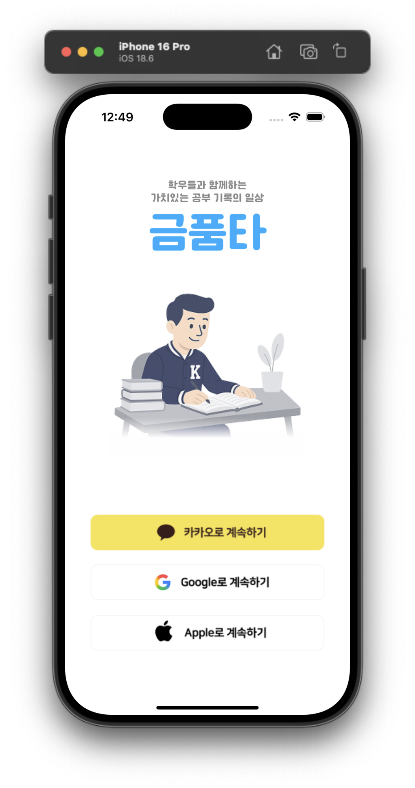 |
| **학과 선택** | 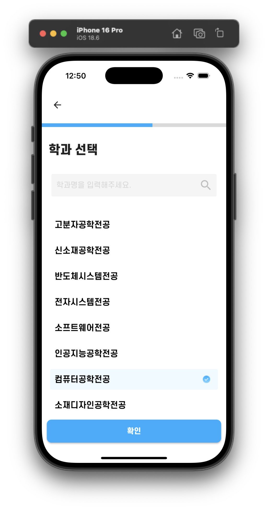 |
| **이메일 인증** | 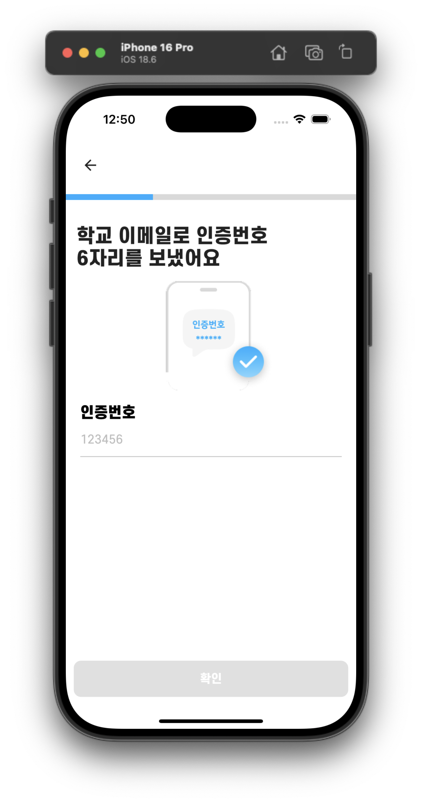 |
| **약관 동의** | 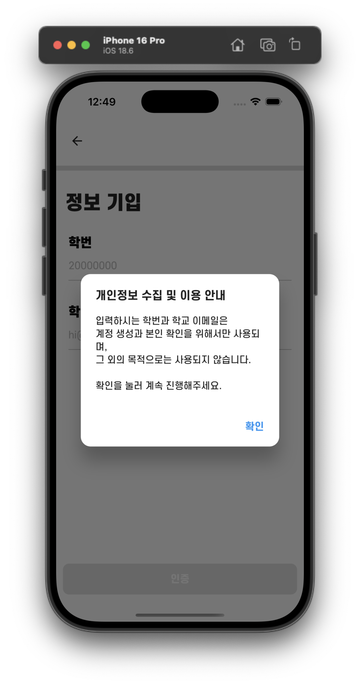 |

### 5-2. 메인 홈 / 타이머 (Main & Timer)

| 화면 | 스크린샷 |
|:---:|:---:|
| **메인 타이머** | 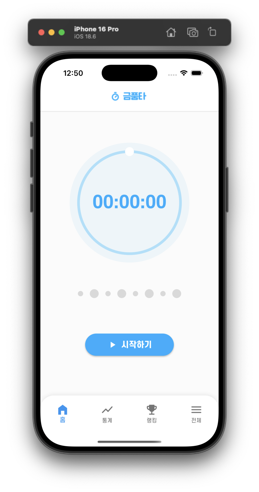 |
| **타이머 동작** | 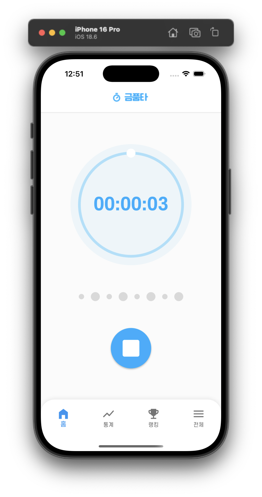 |
| **와이파이 에러** | 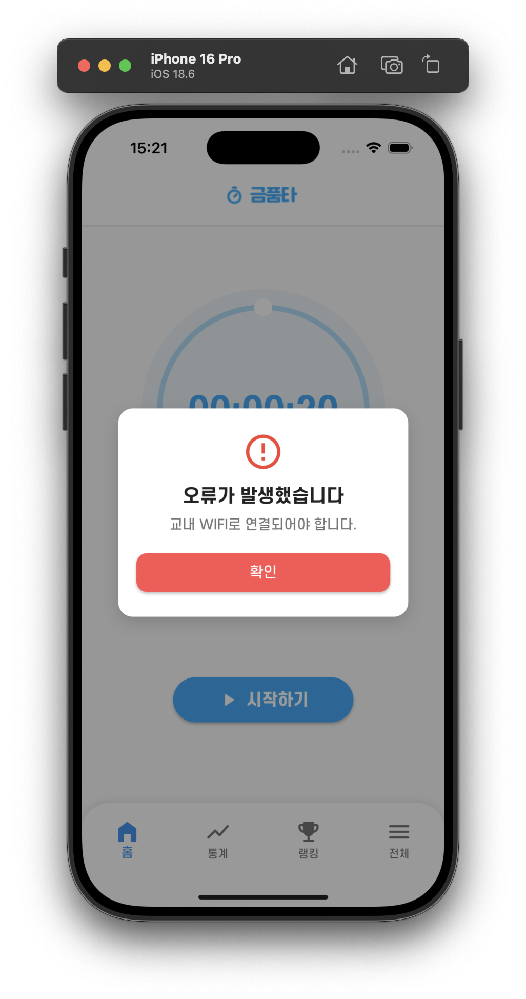 |
| **종료 경고** | 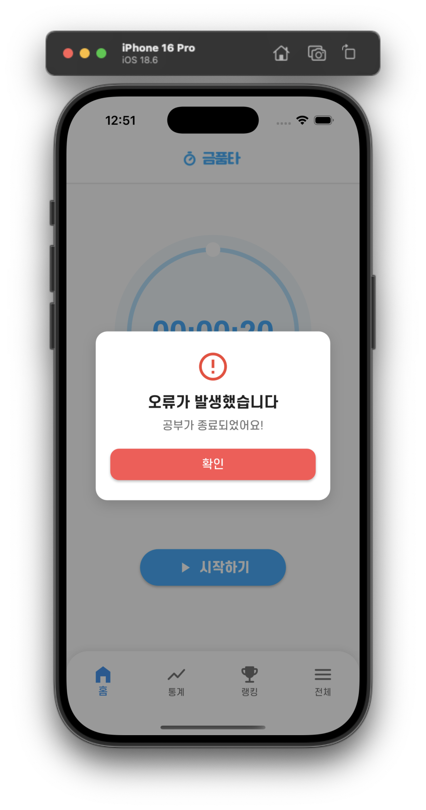 |

### 5-3. 랭킹 (Ranking)

| 화면 | 스크린샷 |
|:---:|:---:|
| **학과 랭킹 (일간)** | 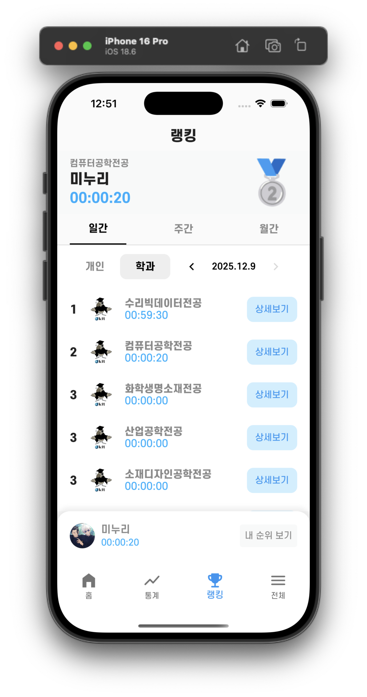 |
| **학과 랭킹 (주간)** | 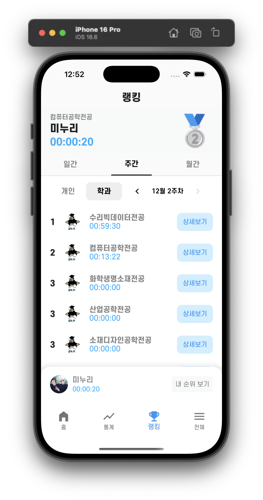 |
| **학과 랭킹 (월간)** | 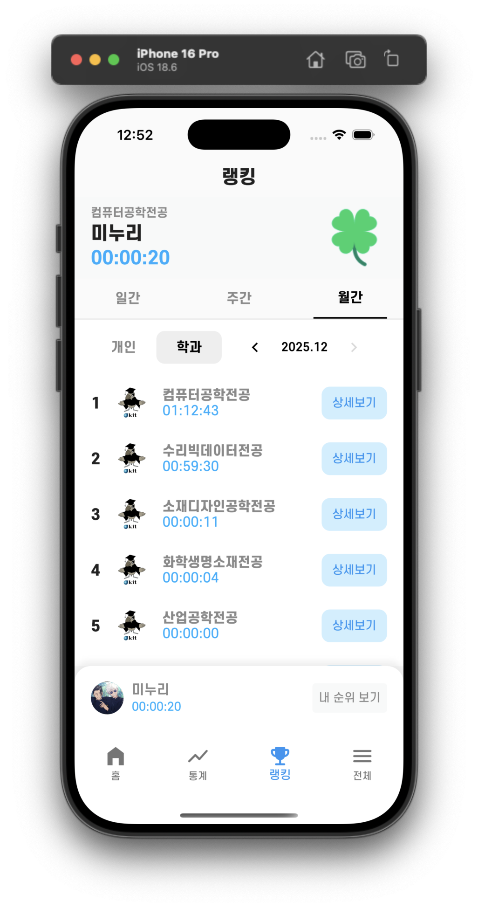 |
| **개인 랭킹** | 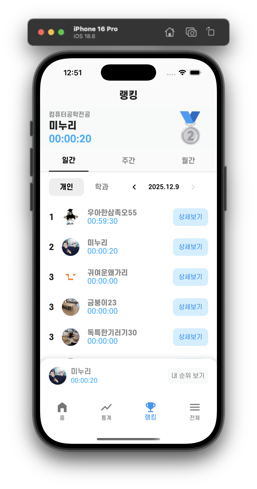 |

### 5-4. 통계 (Statistics)

| 화면 | 스크린샷 |
|:---:|:---:|
| **일간 통계** | 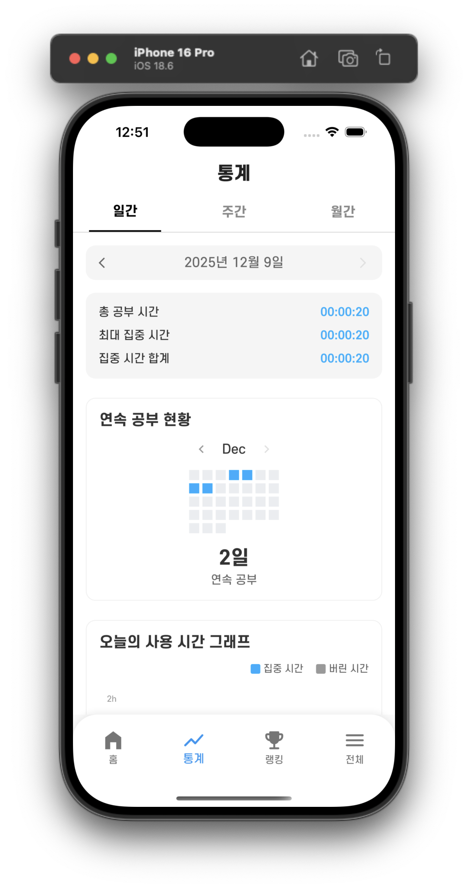 |
| **주간 통계** | 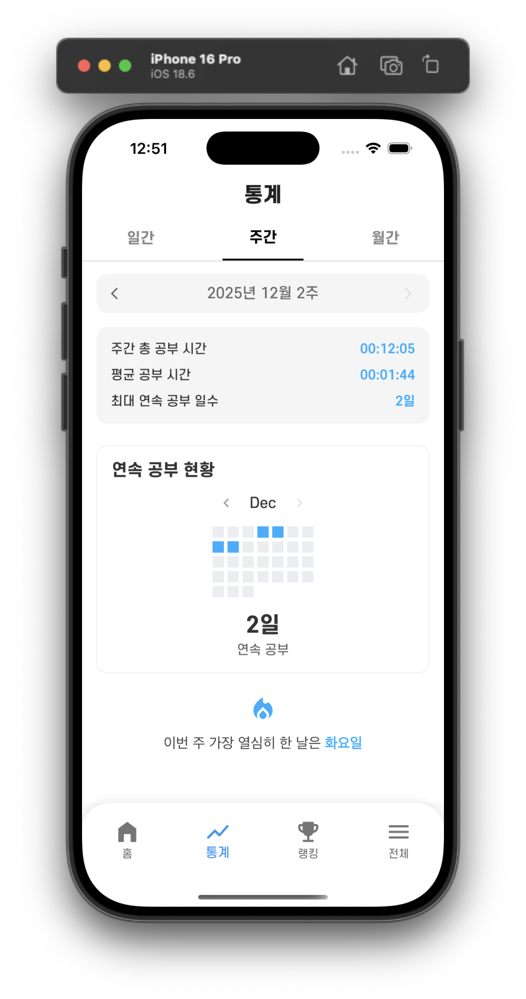 |
| **월간 통계** | 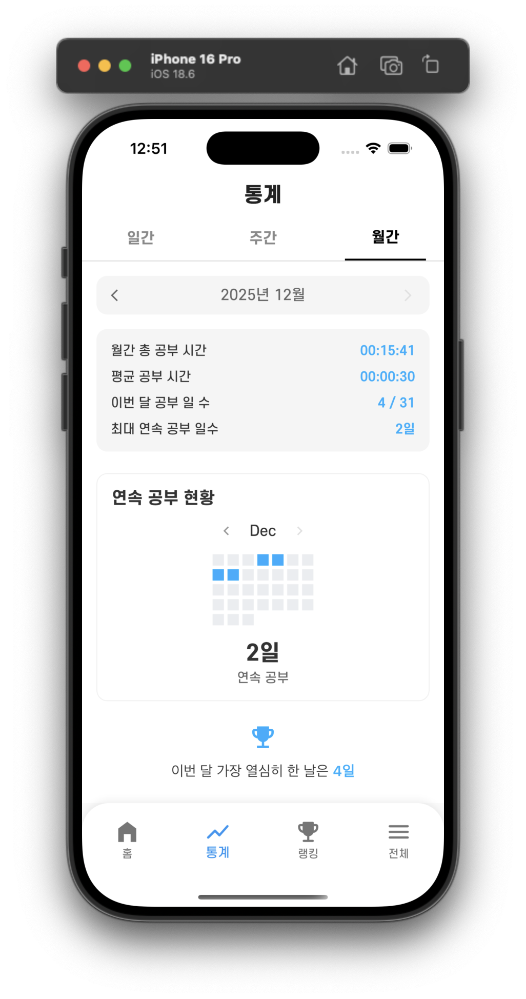 |
| **상세 그래프** | 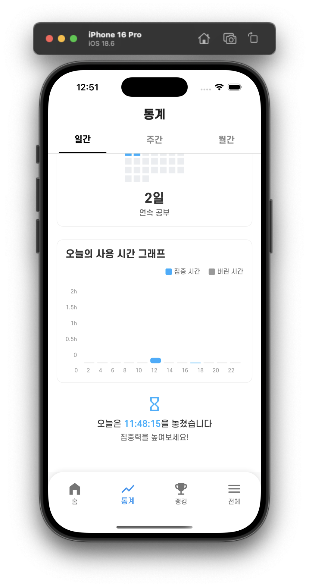 |

### 5-5. 프로필 / 기타 (Profile & Others)

| 화면 | 스크린샷 |
|:---:|:---:|
| **프로필 수정** | 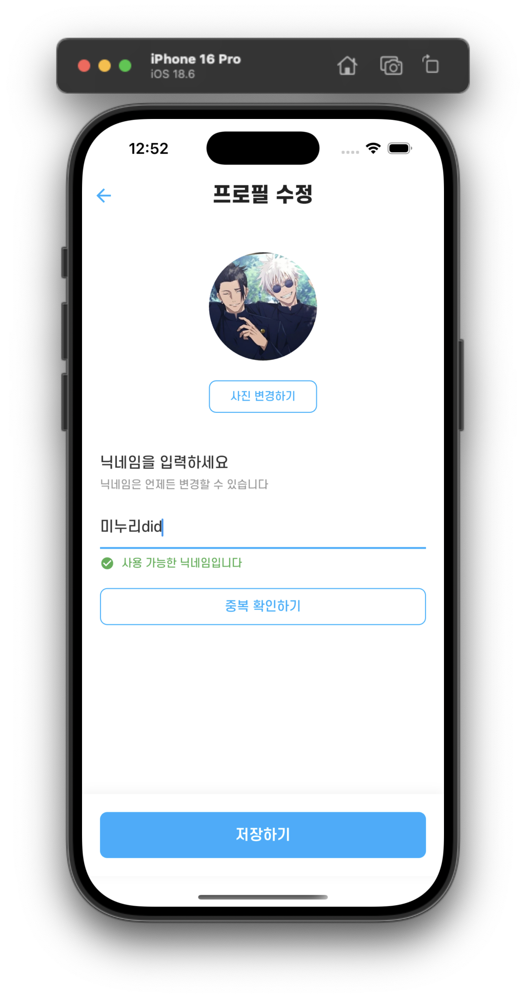 |
| **로그인 에러** | 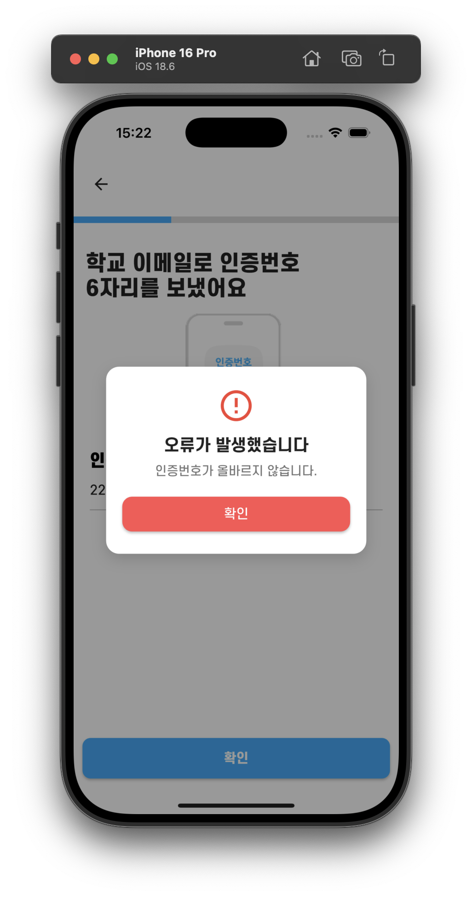 |
| **중복 로그인** | 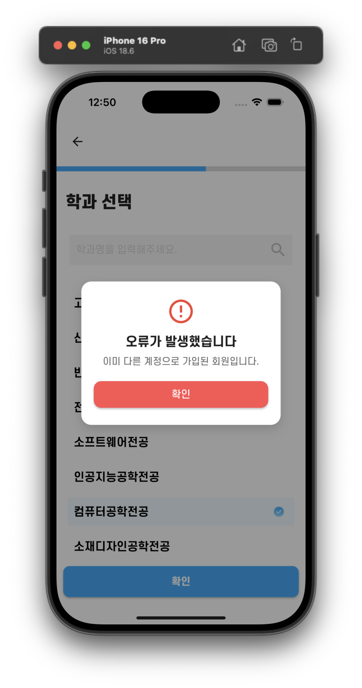 |
| **기타 화면** | 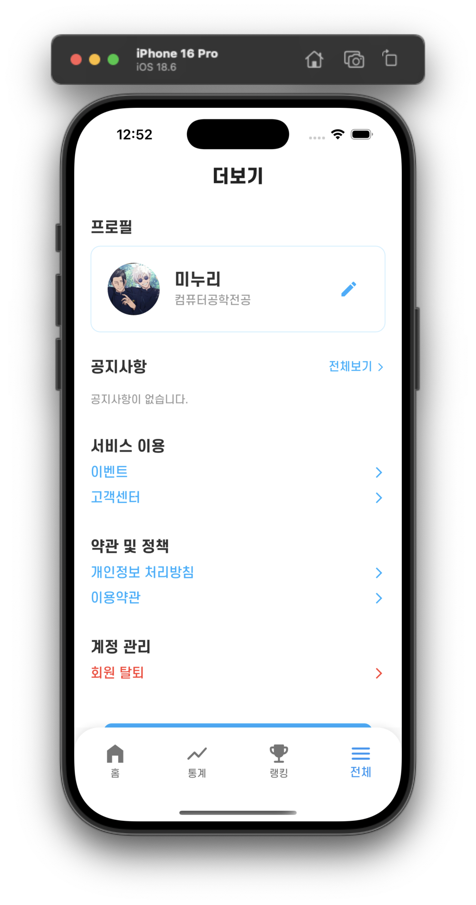 |

---

## 6. 팀 구성

| Role              | Member |
|-------------------|--------|
| Frontend(메인, 랭킹)  | 이민우    |
| Frontend(통계, 더보기) | 허광민    |

---

## 7. 향후 업데이트 계획

- Wi-Fi 인증 외 GPS / Beacon 기반 자리 인증 도입
- 주간 학습 목표 설정 기능 추가
- 업데이트된 디자인 시스템 적용
- Firebase Analytics / Crashlytics 연동
